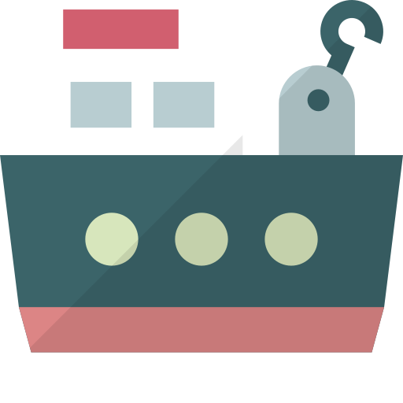

<p align="center"></p>

# dockge-mod

A drop-in replacement for [Dockge](https://github.com/louislam/dockge) by Louis Lam, with a reworked interface and new features. It uses the same data directory, database, stacks directory, and environment variables, so you can switch an existing Dockge installation to dockge-mod and back without a migration.

Dockge manages Docker Compose stacks from a web interface. Your compose files stay on disk, and you can keep using `docker compose` from the command line.

The full list of changes is in the [changelog](CHANGELOG.md).


## Features

Everything Dockge does, plus:

- **Override files.** Create and edit `compose.override.yaml` next to `compose.yaml`, with a settings page for the default content.
- **Git checkouts as stacks.** The stack list shows the branch and uncommitted changes. **Pull & Redeploy** runs `git pull` and deploys.
- **Image update checks.** The server checks the registries every six hours and marks stacks with newer images.
- **Notifications** to a webhook, ntfy, or Apprise for new image versions, containers that exit with an error, and unhealthy containers.
- **Backups of stack files.** Each save and git pull keeps a copy of the compose, `.env`, and override files. The last 20 copies per stack can be restored.
- **Resources page.** List and remove images, volumes, and networks. Removing unused items shows the exact list first, and keeps everything that belongs to a stack.
- **Per-service logs, Validate, and Merged config** (`docker compose config`) on the stack page.
- **`.env` editor** with a row per variable, and a global `.env` for all stacks.
- **Bulk actions** and a status filter in the stack list.
- **Health page** that checks Docker, Compose, Git, and write access to the directories.
- Host statistics on the home page: load, memory, and Docker disk usage.

## Install

Requirements: Docker 20 or later on Linux, on amd64, arm64, or armv7. Podman with `podman-docker` works for the Dockge features; the new features (event watcher, image checks, Resources page) are tested on Docker only.

The image is [`ethanpil/dockge-mod`](https://hub.docker.com/r/ethanpil/dockge-mod) on Docker Hub. Each release has two tags: `latest` and a fixed version such as `1.5.0-mod-a1b2c3d`. **Settings** > **About** shows the version you run.

1. Create a directory for your stacks and one for dockge-mod:

   ```bash
   mkdir -p /opt/stacks /opt/dockge-mod
   ```

2. Save this as `/opt/dockge-mod/compose.yaml`:

   ```yaml
   services:
     dockge-mod:
       image: ethanpil/dockge-mod:latest
       restart: unless-stopped
       ports:
         - 5001:5001
       volumes:
         - /var/run/docker.sock:/var/run/docker.sock
         - ./data:/app/data
         # The stacks directory. Use an absolute path, and the same path on both sides.
         - /opt/stacks:/opt/stacks
       environment:
         - DOCKGE_STACKS_DIR=/opt/stacks
   ```

   The stacks path must be identical on both sides of the colon (`/opt/stacks:/opt/stacks`). Docker Compose resolves relative paths in your stacks against the host path, so a different path inside the container breaks bind mounts.

3. Start it:

   ```bash
   cd /opt/dockge-mod && docker compose up -d
   ```

4. Open `http://<host>:5001` and create the admin account.

### Switch from Dockge

1. Stop Dockge: `docker compose down` in its directory.
2. Back up its `data` directory.
3. Change the `image` line to `ethanpil/dockge-mod:latest`.
4. `docker compose up -d`.

Your users, settings, agents, and stacks carry over. To go back, change the `image` line again. See [Compatibility](#compatibility) for what changes.

### Upgrade

```bash
cd /opt/dockge-mod && docker compose pull && docker compose up -d
```

### Build the image yourself

```bash
git clone https://github.com/ethanpil/dockge-mod.git
cd dockge-mod && docker build --target release -f docker/Dockerfile -t dockge-mod:local .
```

Then use `image: dockge-mod:local`. Node.js is not needed on the host.

## Compatibility

Compatibility with Dockge is the main goal of this project. dockge-mod is based on Dockge upstream commit [`f809ae1`](https://github.com/louislam/dockge/commit/f809ae192b571944ad773e9866d3e67064ae8043) and works with databases and agents from the Dockge **1.5.0** release.

- **Database.** dockge-mod keeps its own data in tables prefixed `mod_`, with a separate migration ledger (`mod_knex_migrations`). It never changes the Dockge tables or the Dockge migration ledger.
- **Stacks directory.** Same layout. Override files, `.env` files, and `.git` directories are standard Docker Compose and git files that Dockge ignores or leaves alone.
- **Environment variables.** Same names and defaults. They keep the `DOCKGE_` prefix.
- **Agents.** A dockge-mod server can manage Dockge agents, and a Dockge server can manage dockge-mod agents.

### Going back to Dockge

Change the image back. Nothing is lost, but:

- The `mod_` tables stay in the database. Dockge ignores them, and dockge-mod picks them up again if you return.
- Dockge does not show override files, but `docker compose` still applies them.
- Dockge 1.5.0 does not use `global.env`. Variables defined only there are missing on the next deploy.
- Friendly agent names need a database column that Dockge 1.5.0 does not create. On a database that Dockge 1.5.0 created, agents show their host name, and renaming is not available.

### Differences in behavior

- **Override files on save.** An empty override editor deletes the override file on save.
- **Backups contain secrets.** The backups keep copies of `.env` files in the database, so `dockge.db` is more sensitive than with Dockge.
- **Time limits.** Docker queries (status, stats, inspect) time out after 30 seconds. A compose operation (up, pull, down) is stopped after 60 minutes. The interface stops waiting for an answer after 5 minutes, but the operation keeps running and its result still shows. Dockge has no limits.
- **Dockge agents.** Features that only dockge-mod has (Resources page, backups, image checks, service logs, per-service start/stop) are hidden or time out after 30 seconds on a Dockge agent.
- **Background work.** dockge-mod watches `docker events`, checks registries every six hours (one HEAD request per image, which does not count against the Docker Hub pull limit), and reads `docker system df` every 10 minutes while the home page is open.

## Usage notes

### Panels and editors

Drag the bar under a panel to resize it; double-click to reset. In edit mode, the `.env` panel shows one row per variable. Click **Text** to edit the raw file. **Settings** > **Global .env** has the same editor.

### Override files

Put local changes in an override file when the base compose file comes from somewhere else, such as a git repository. In edit mode, click **Create override** below the compose editor. dockge-mod uses the first of `compose.override.yml`, `compose.override.yaml`, `docker-compose.override.yml`, and `docker-compose.override.yaml` that exists.

**Merged config** shows the output of `docker compose config` for the files on disk. **Validate** runs the same check on the editor content without saving.

### Git checkouts

If a stack directory is a git checkout, the stack shows its branch (or commit, when detached) and a dot for uncommitted changes to tracked files. **Pull & Redeploy** runs `git pull` and then deploys.

For a private repository over SSH, mount a key and a `known_hosts` file, for example `- /root/.ssh:/root/.ssh:ro`. Git runs with `ssh -o BatchMode=yes`, so it fails instead of prompting. Set `GIT_SSH_COMMAND` to override this.

### Image update checks

The server compares the local image digest with the registry every six hours. Stacks with newer images show a badge. **Update** pulls and recreates the stack and clears the badge. The **Resources** page shows the last check of each image and a **Check now** button.

Private registries: mount your Docker credentials (`- /root/.docker:/root/.docker:ro`). Credentials stored in a credential helper (`credsStore` / `credHelpers`) are not supported, because the helper binaries are not in the image; public images of such a registry are still checked anonymously. For a registry with a private CA, mount the CA file and set `NODE_EXTRA_CA_CERTS` to its path.

### Notifications

**Settings** > **Notifications**. Each target gets a POST request:

| Type | Body |
| --- | --- |
| Webhook | JSON: `{"event", "title", "message", "time"}` |
| ntfy | The message as text, with `Title` and `Tags` headers |
| Apprise | JSON: `{"title", "body", "type": "info"}` |

Events are `image_update`, `container_exited`, `container_unhealthy`, and `test`. A container sends at most one message per event every five minutes. A container that you stop does not count as exited. Notifications are per server: configure them on each agent to get alerts from its containers.

### Backups

Each save and git pull stores the previous compose, `.env`, and override files in the database. The last 20 per stack are kept and are deleted with the stack. Open a stack and click **Backups** to restore one. Restoring writes the files; click **Deploy** to apply them.

### Removing unused resources

The **Resources** page never runs `docker ... prune`. It builds a list first, shows it, and removes only those items. It keeps:

- Anything a container uses, running or stopped.
- Images, networks, and volumes of any stack on this server, running or not.
- Images named in a compose file, including by digest or from a build.
- Named volumes. Only anonymous volumes can be removed, and those that a stack created are kept even after `docker compose down`.
- The `bridge`, `host`, and `none` networks.

Images of other programs on the same host can appear in the list. Read it before you confirm. If dockge-mod cannot read a compose file or inspect every container, it refuses to remove anything.

### Host terminal

The host console is off by default. Set `DOCKGE_ENABLE_CONSOLE=true` to enable it. It gives root access to the container, which has the Docker socket, so treat it as root on the host.

### Multiple hosts

Install dockge-mod (or Dockge) on each host. On the main server, click **Add Agent** on the home page and enter the URL, username, and password of the other server. The main server connects to the agent's URL; the agent does not need to reach the main server. The agent password is stored in the main server's database in plain text, as in Dockge.

## Operations

### Back up

Stop the container and copy the `data` directory. The database is SQLite in WAL mode; if you copy it while it runs, include `dockge.db-wal` and `dockge.db-shm`.

### Reset the password

```bash
docker compose exec dockge-mod npm run reset-password
```

### Reverse proxy

The interface uses a WebSocket. The proxy must forward the `Upgrade` and `Connection` headers and the original `Host` header. For nginx:

```nginx
location / {
    proxy_pass http://127.0.0.1:5001;
    proxy_http_version 1.1;
    proxy_set_header Upgrade $http_upgrade;
    proxy_set_header Connection "upgrade";
    proxy_set_header Host $host;
}
```

Caddy and Traefik work without extra settings. If the log shows `Origin ... does not match host`, the proxy changes the `Host` header. Fix the proxy, or set `UPTIME_KUMA_WS_ORIGIN_CHECK=bypass` to turn the check off.

### Troubleshooting

- **A stack is missing from the list.** The stack must be in `<stacks dir>/<name>/compose.yaml` (or `docker-compose.yml`), and the stacks path must be the same inside and outside the container. Click **Scan Stacks Folder** in the top-right menu after you move files.
- **Something fails.** **Settings** > **Health** checks the tools and the directories. The server log is `docker compose logs dockge-mod`.
- **A Dockge agent times out.** See [Differences in behavior](#differences-in-behavior).

## Environment variables

| Name | Default | Description |
| --- | --- | --- |
| `DOCKGE_STACKS_DIR` | `/opt/stacks` | The stacks directory. |
| `DOCKGE_DATA_DIR` | `./data/` | The directory for the database. |
| `DOCKGE_PORT` | `5001` | The HTTP port. |
| `DOCKGE_HOSTNAME` | all addresses | The address to listen on. |
| `DOCKGE_ENABLE_CONSOLE` | `false` | `true` enables the host terminal. |
| `DOCKGE_SSL_KEY`, `DOCKGE_SSL_CERT` | none | Paths to a TLS key and certificate. |
| `DOCKGE_SSL_KEY_PASSPHRASE` | none | The passphrase of the TLS key. |
| `PUID`, `PGID` | none | Owner of the stack files that dockge-mod writes. Set both, or neither. |
| `TZ` | detected | Time zone of the server. |
| `DOCKGE_HIDE_LOG` | none | Log lines to hide, for example `debug_server,info_monitor`. |
| `UPTIME_KUMA_WS_ORIGIN_CHECK` | none | `bypass` turns off the WebSocket origin check. |
| `GIT_SSH_COMMAND` | `ssh -o BatchMode=yes` | The SSH command for git. |
| `NODE_EXTRA_CA_CERTS` | none | A CA file for registries with a private certificate. |

`PUID` and `PGID` are from upstream master and have no effect in Dockge 1.5.0.

## Security

- The container runs as root and has the Docker socket, which is root access to the host. Do not expose dockge-mod to the internet without a reverse proxy with TLS, and ideally an extra authentication layer.
- There is one user account.
- Anyone who can write to the stacks directory can get root on the host, for example with a privileged compose file or with the config of a git checkout that **Pull & Redeploy** runs. Only trusted users should have write access there.
- `data/dockge.db` holds the password hash, the agent passwords, and the `.env` backups. Protect it and its backups.

Report vulnerabilities as described in [SECURITY.md](SECURITY.md).

## Contributing

Bug reports and feature requests are welcome in the [issues](https://github.com/ethanpil/dockge-mod/issues). Report problems here first, even if they may come from Dockge; they will be passed upstream when that is the case. This is a personal fork, so pull requests may not be accepted.

## Translations

The interface has all the languages of Dockge. Texts for the new features are machine translated. If a translation is wrong, open an issue with the key and the correct text.

## AI assistance

This fork was developed with help from Claude.

## Credits

The logo is the "cargo ship" icon by Flat Icon Design, from [SVG Repo](https://www.svgrepo.com/), in the public domain.

## License

MIT, the same as Dockge. The original code is copyright Louis Lam. See [LICENSE](LICENSE).
